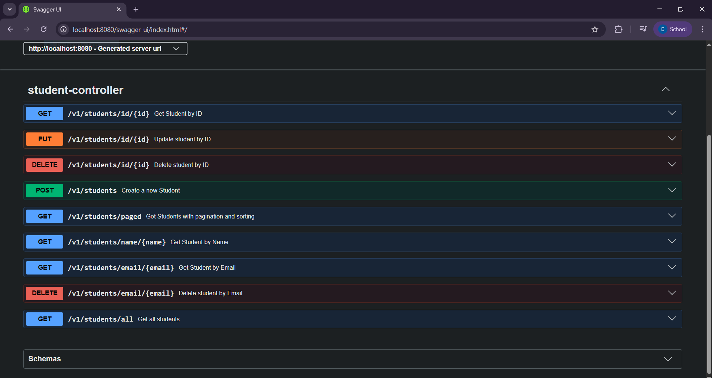
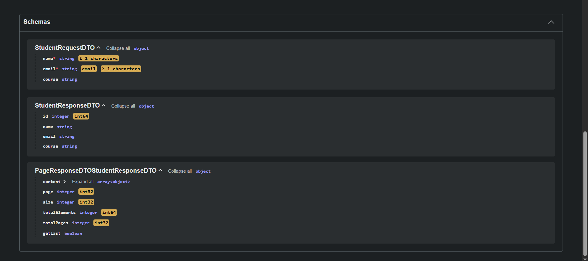
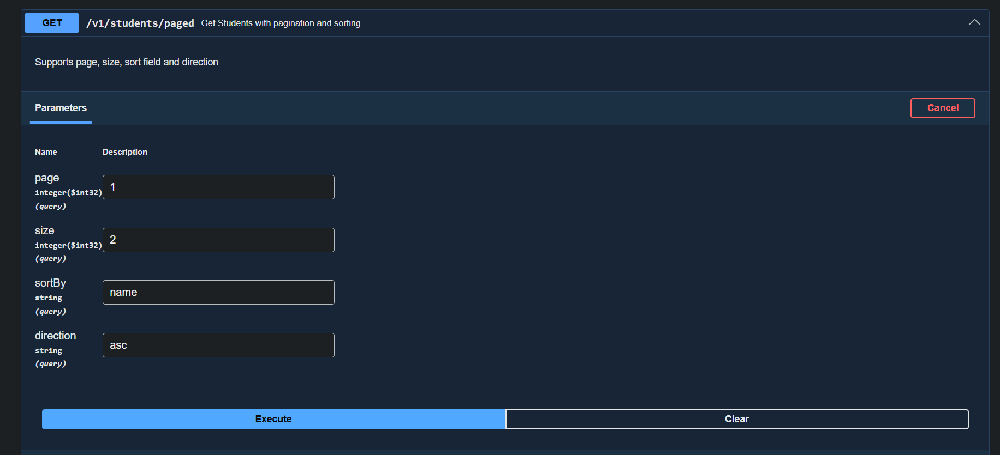
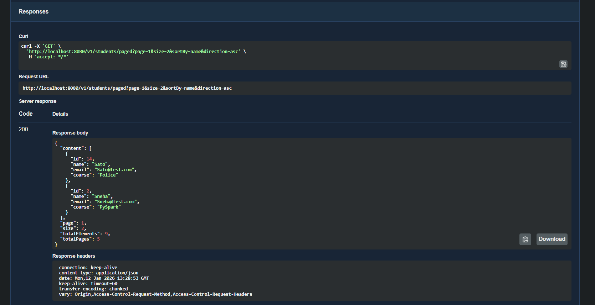
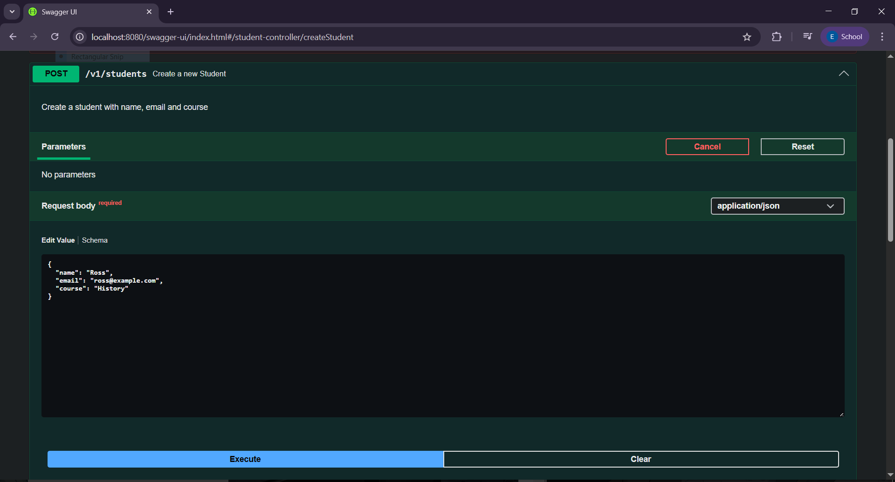
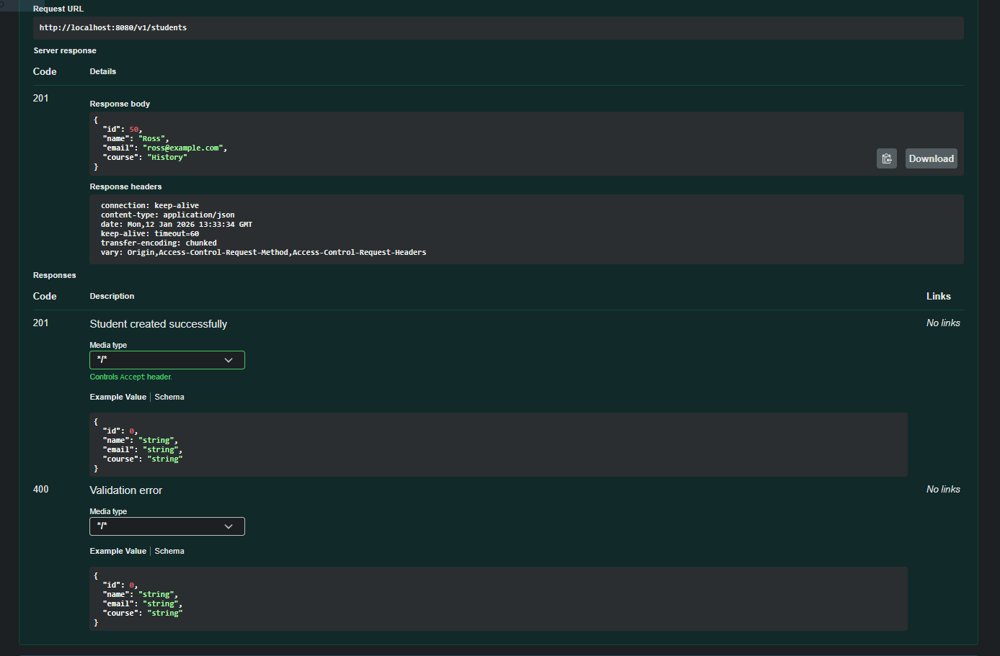

# Student Management System

A Spring Boot REST API for managing student records.

## 🚀 Features
- Create, Read, Update, Delete students
- Search by ID, Email, Name
- Input validation using Jakarta Validation
- Exception handling
- Layered architecture ( Entity, DTO, Service,ServiceImp, Repository, Controller)
- Pagination an Sorting ( Offset Pagination )

## 🛠 Tech Stack
- Java 21+
- Spring Boot
- Spring Data JPA
- Hibernate
- PostgresSQL
- Maven
- Swagger (Sringdoc OpenAPI)

## API Documentation (Swagger UI)
This project integrates Swagger UI to provide interactive and auto-generated API documentation.
###🔗 Swagger UI URL
- After starting the application, open:
 [http://localhost:8080/swagger-ui/index.html] 

You can:
- View all available REST APIs
- Test endpoints directly from the browser
- Inspect request and response schemas

## 📸 Swagger UI Preview

<table>
  <tr>
    <td></td>
    <td></td>
  </tr>
  <tr>
    <td></td>
    <td></td>
  </tr>
  <tr>
    <td></td>
    <td></td>
  </tr>
</table>

## 📌 API Endpoints
| Method | Endpoint              | Description |
|------|-----------------------|-------------|
| POST | /v1/students          | Create student |
| GET | /v1/students/all      | Get all students |
| GET | /v1/students/id/{id}  | Get by ID |
| GET | /v1/students/email/{email} | Get by email |
| GET | /v1/students/name/{name} | Get by name |
| PUT | /v1/students/{id}     | Update student |
| DELETE | /v1/students/id/{id}  | Delete by ID |

## 📄 Pagination & Sorting

### Example Endpoints
| Method | Endpoint             |
|------|----------------------|
| GET | /v1/students/paged   |

### Query Parameters
| Parameters | Description                 | Example       |
|------------|-----------------------------|---------------|
| Page       | Page number (0-based)       | page=0        |
| size       | Number of records per page  | size=4        |
| sort       | Sorting field and direction | sort=name.asc |

### Example Requests
| Method | Endpoint                                                    |
|------|-------------------------------------------------------------|
| GET | /v1/students/paged?page=0&size=4&sortBy=name&direction=desc |
| GET | /v1/students/paged?page=0&size=4&sort=name,asc              |

## 🧪 Status
🚧 **Work in Progress**

## 📌 Author
Vaibhav Lad
